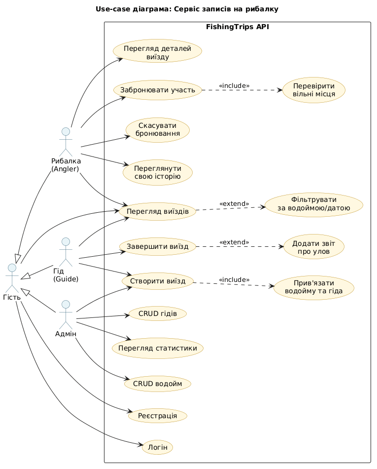

# FishingTrips — Web API «Записи на рибалку»

Лабораторна робота №2 з курсу **Інформаційні системи та технології програмування**.

ASP.NET Core Web API + EF Core (Code First, SQLite) + vanilla-JS frontend + Docker + xUnit.

## Етапи

| Етап | Опис | Статус |
|------|------|--------|
| 2.0  | Use-case діаграма (`docs/usecase.png`) | ✅ |
| 2.1  | Web API + модель + DbContext (Code First) + Docker | ✅ |
| 2.2  | Контролери (CRUD + business endpoints) | ✅ |
| 2.3  | Frontend на JS у `wwwroot/` | ✅ |
| 2.4  | Unit-тести (41 тест, xUnit + Moq + FluentAssertions) | ✅ |

## Предметна область

Сервіс бронювання рибальських виїздів. Користувачі (`Angler`) записуються на виїзди (`FishingTrip`), які проводять гіди (`Guide`) на конкретних водоймах (`Waterbody`). Зв'язок M:N між рибалкою та виїздом реалізований через явну join-сутність `TripParticipant` із payload-полями (`BookedAt`, `Attended`, `CatchWeightKg`).

### Use-case діаграма



### ER-діаграма (текстом)

```
Waterbody 1 ──< FishingTrip >── 1 Guide
                    │
                    │ 1
                    │
                    ∨ N
              TripParticipant
                    │
                    │ N
                    │
                    ∨ 1
                 Angler
```

## Стек

- **.NET 9** + ASP.NET Core (controllers)
- **EF Core 9** + SQLite (Code First, automatic migrations on startup)
- **Swagger** (Swashbuckle)
- **Vanilla JS** + сучасний CSS (без фреймворків)
- **Docker** (multi-stage build)
- **xUnit + Moq + FluentAssertions + EFCore.InMemory**

## Запуск

### Локально (.NET SDK 9)

```bash
dotnet run --project src/FishingTrips.Api
```

→ <http://localhost:5080>
- UI: `/`
- Swagger: `/swagger`
- API: `/api/...`

### Через Docker

```bash
docker compose up --build
```

→ <http://localhost:8080>

База SQLite зберігається у named volume `fishingtrips-data`.

## API ендпоінти

### Anglers (рибалки)
- `GET /api/anglers`
- `GET /api/anglers/{id}`
- `GET /api/anglers/{id}/trips`
- `POST /api/anglers`
- `PUT /api/anglers/{id}`
- `DELETE /api/anglers/{id}`

### Guides (гіди)
- `GET|POST /api/guides`, `GET|PUT|DELETE /api/guides/{id}`

### Waterbodies (водойми)
- `GET|POST /api/waterbodies`, `GET|PUT|DELETE /api/waterbodies/{id}`
- `GET /api/waterbodies/{id}/trips`

### FishingTrips (виїзди)
- `GET /api/fishingtrips?waterbodyId=&guideId=&from=&to=` — список з фільтрами
- `GET|PUT|DELETE /api/fishingtrips/{id}`
- `POST /api/fishingtrips` — створити
- `GET /api/fishingtrips/{id}/participants`
- `POST /api/fishingtrips/{id}/book` — `{ "anglerId": N }`
- `DELETE /api/fishingtrips/{id}/book/{anglerId}` — скасувати бронювання
- `POST /api/fishingtrips/{id}/complete` — `{ "catchByAnglerId": { "1": 2.5 } }`

## Бізнес-правила

Реалізовані у `FishingTripService` і покриті тестами:
- Не можна забронювати завершений/скасований виїзд (`409 Conflict`).
- Не можна забронюватися двічі на той самий виїзд.
- Не можна перевищити `MaxParticipants`.
- Не можна редагувати `MaxParticipants` нижче поточної кількості бронювань.
- При завершенні виїзду фіксується `Attended` та опціонально `CatchWeightKg` для кожного учасника.

## Тести

```bash
dotnet test
```

→ **41 тест проходить**. Покриття: сервісний шар (бізнес-логіка бронювання, валідація, фільтри) + контролери (статус-коди, маппінг ServiceResult → ActionResult).

## Структура

```
FishingTrips/
├── Dockerfile, docker-compose.yml
├── docs/usecase.puml + usecase.png
├── src/FishingTrips.Api/
│   ├── Models/         ← Angler, Guide, Waterbody, FishingTrip, TripParticipant + Enums
│   ├── Data/AppDbContext.cs  ← Fluent config + HasData seed
│   ├── DTOs/Dtos.cs
│   ├── Services/       ← IFishingTripService + ServiceResult<T>
│   ├── Controllers/    ← 4 контролери
│   ├── Migrations/     ← EF Core Initial migration
│   ├── wwwroot/        ← index.html, styles.css, app.js (SPA-стиль, vanilla JS)
│   └── Program.cs
└── tests/FishingTrips.Tests/
    ├── Services/FishingTripServiceTests.cs (26 тестів)
    └── Controllers/{AnglersControllerTests, FishingTripsControllerTests}.cs (15 тестів)
```
